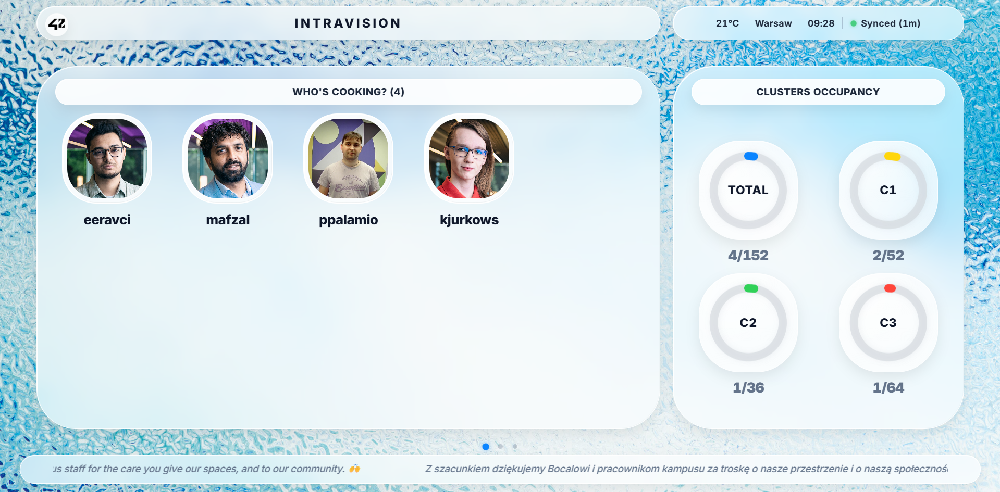
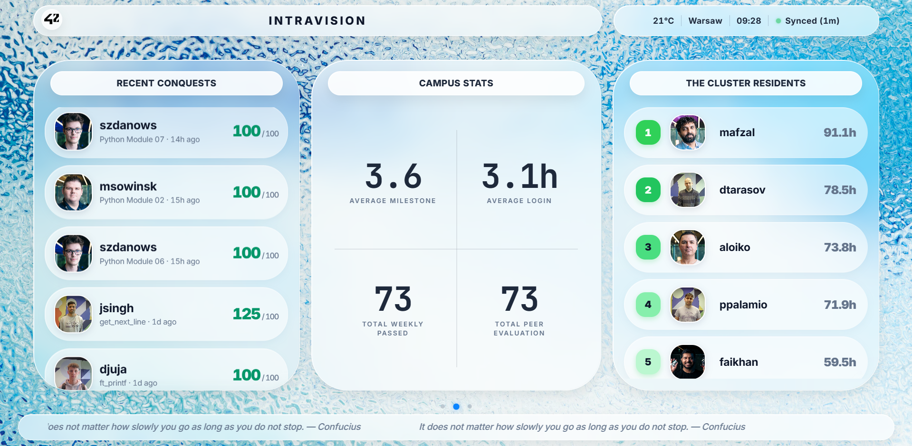
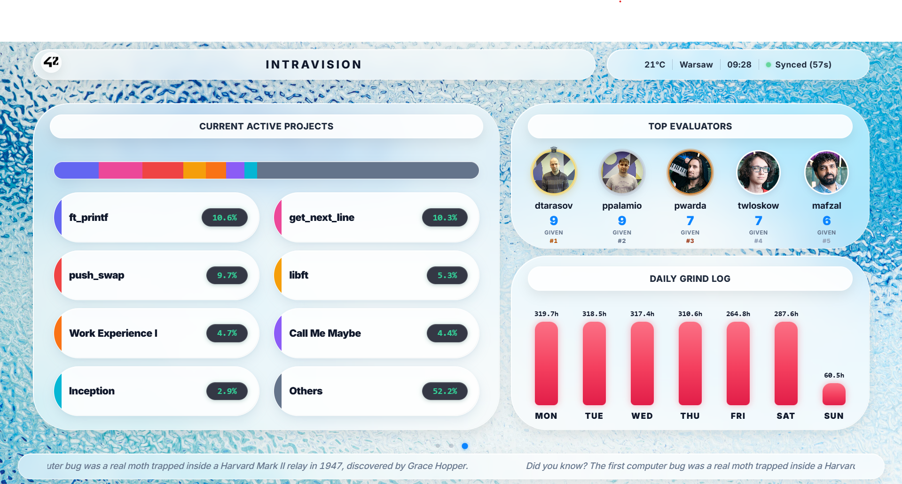

<!-- File: README.md -->

# Intra-Vision — 42 Warsaw Hacks

Passive TV dashboard for the 42 Warsaw Social Space: live campus progress from the Intra API,
rendered for a 1920×1080 screen nobody touches.

## Screens

**Page 1 — Who's cooking / Clusters occupancy**



**Page 2 — Recent conquests / Campus stats / Cluster residents**



**Page 3 — Active projects / Top evaluators / Daily grind log**



## Setup

```bash
make setup          # creates .venv, installs httpx / fastapi / uvicorn / jinja2 / pytest
```

Create `.env.local` in the repo root (gitignored):

```bash
FORTYTWO_APP_UID=...
FORTYTWO_APP_SECRET=...
FT_CAMPUS_ID=67     # Warsaw
FT_CURSUS_ID=21     # 42cursus (Common Core)
```

The ids are read from `FT_CAMPUS_ID` / `FT_CURSUS_ID`. Credentials are also accepted as
`FT_UID` / `FT_SECRET` or `FORTYTWO_UID` / `FORTYTWO_SECRET`. Re-resolve the ids with
`make resolve-ids` (needs credentials).

## Running

```bash
make demo           # rebuilds metrics from fixtures/ and serves on :8000 — zero API calls
make serve          # serves on :8000 and re-fetches live Intra data every 120s in the background
make fetch-live     # one live fetch (~40 API requests), saves fixtures/
make fetch          # rebuild metrics from fixtures/ only, no server, no API
make test           # 39 unit tests, no network, no credentials
```

`make demo` is the offline path — safe if Intra is down or quota is gone.
`make serve` is the live path — it spends quota continuously until you Ctrl+C.

Force a refresh while the server is up:

```bash
curl -X POST http://localhost:8000/refresh    # 202, fetch runs in the background
```

## What works

- OAuth2 client credentials + a serialized request queue: 2 req/s, 1200 req/hr, 429 handled via `Retry-After`.
- Live Warsaw fetch across 6 collections (projects_users ×2 queries, cursus_users, locations ×2,
  blocs/coalitions, scale_teams). Last live run: 40 requests.
- Processed metrics, not raw API echoes — validations feed, cluster occupancy, active projects,
  top evaluators, weekly logtime, median level.
- SQLite cache; page renders cost zero API quota.
- `POST /refresh` → 202 + background fetch, with a lock against overlapping runs.
- Offline mode from committed `fixtures/` (`make demo`).
- Three rotating TV views with a stale-data stamp that goes amber after 30 minutes.
- 39 tests passing (`make test`).

## Not done / limitations

- **Nothing is deployed.** Demo is `localhost:8000`. Render + MagicInfo is a plan only —
  see [docs/architecture.md](docs/architecture.md).
- The 120 s refresh loop in `make serve` sits at ~1200 req/hr, i.e. exactly the hourly cap.
  Production needs 10 minutes.
- `/v2/campus/:id/stats` returns 403 and two `/graph` paths return 422 on my token tier —
  those panels don't exist.
- Coalition scores are fetched and stored, but no view shows them.
- Retry count (`occurrence + 1`) is computed but not shown in the UI.
- No genuinely anonymised account showed up in the data I pulled, so that fallback is unit-tested only.
- Never run on the real Social Space TV or through MagicInfo.
- I started on Next.js and pivoted to FastAPI on day one — that scaffold is gone from the repo.

## Docs

- [docs/42-api.md](docs/42-api.md) — endpoints, rate limits, data quirks, failure behaviour
- [docs/architecture.md](docs/architecture.md) — services, data flow, deployment plan
- [docs/pitch.md](docs/pitch.md) — 5-minute pitch script + expected Q&A
