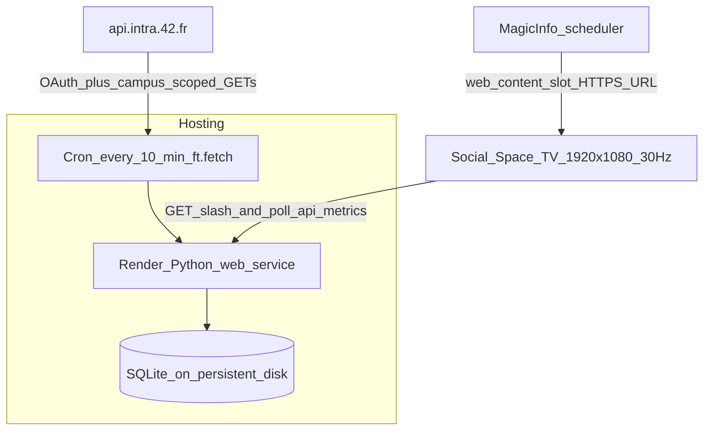
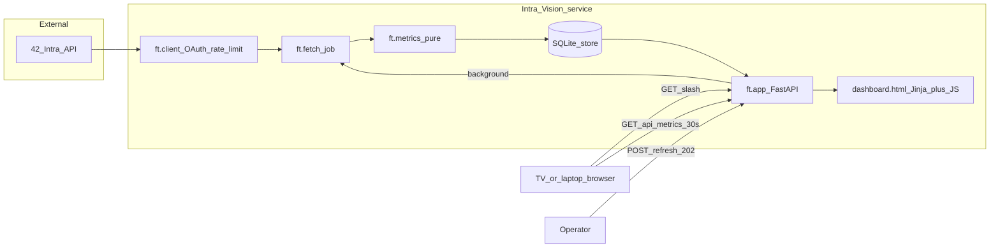
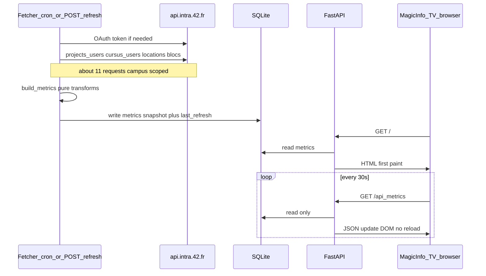

<!-- File: docs/architecture.md -->

# Technical architecture — Intra-Vision

**Deliverable 2.** Realistic plan to run “Learning Progress Insights” on the 42 Warsaw Social
Space TV. Updated **1 Aug 2026** to match the opening brief and the shipped PoC.

This document answers the four grading prompts in order:

1. What is the solution, and how is it used?  
2. How will it display on the Social Space TV?  
3. Why this tech stack?  
4. Architecture diagram — services + data flow  

---

## 1. What it is / how it is used

**Intra-Vision** is a **read-only campus dashboard**: a single FullHD webpage that celebrates
Common Core progress (recent validations, who’s on campus, coalition standings, level shape).

| Actor | How they use it |
|---|---|
| **Students in the Social Space** | Look at the TV — no login, no mouse, no Intra app. Content rotates by itself. |
| **Operators / staff** | Point MagicInfo at our URL (or open `localhost:8000` for a demo). Optional: `POST /refresh` to force a data update. |
| **Developers** | `make fetch-live` / `make demo` → SQLite → `make serve`. Secrets stay in `.env.local`. |

It is **not** an admin console, not a personal “my progress” app, and not a site that calls the
42 API from the browser. Viewers only ever talk to **our** server; our server talks to Intra on a
slow schedule and caches processed metrics.

**Hackathon judging:** we demo the same app from a laptop at `http://localhost:8000` (1920×1080).
Organizers confirmed a live public deploy is **not** required for submission — only a realistic
deployment *plan* for the TV (below).

---

## 2. Deployment target — Social Space TV

### Confirmed TV facts (opening presentation)

| Fact | Implication for us |
|---|---|
| MagicInfo signage system | Content is **scheduled** — a “web content” slot points at a URL; nobody manually opens a browser on the TV |
| Displays live websites (also pptx/mp4/images) | We ship a **normal HTTPS webpage**, not a custom kiosk binary |
| **1920×1080 @ 30Hz**, has internet | Layout and motion designed for that exact canvas; avoid sub-200ms flicker |
| May be hosted on campus LAN **or** a public URL | Same FastAPI app either way |

### Path A — planned production (post-win / when staff deploy)

Organizers: only the **1st-place** team is paid to deploy for real (`umowa o dzieło`). Our plan:



**Steps to go live:**

1. Create a **Render** Web Service from this GitHub repo (Python, start command  
   `PYTHONPATH=src uvicorn ft.app:app --host 0.0.0.0 --port $PORT`).
2. Set env vars: `FORTYTWO_APP_UID`, `FORTYTWO_APP_SECRET`, `FT_CAMPUS_ID=67`, `FT_CURSUS_ID=21`.
3. Attach a **persistent disk** for `data/dashboard.db` (survives restarts).
4. Add a cron job (Render Cron or external): every 10 minutes run `python -m ft.fetch`.
5. In **MagicInfo**, create a web-content playlist item → paste the Render HTTPS URL → assign to
   the Social Space display on the usual schedule.
6. Verify once at FullHD: rotating views, readable from across the room, stamp updating.

No special packaging, Electron, or Chromium flags required — MagicInfo’s browser loads the URL.

### Path B — campus-local host (also realistic)

Same app on a small always-on machine on campus wifi (Pi / mini PC):

- `systemd` unit for `uvicorn`
- `cron` for `ft.fetch`
- MagicInfo points at `http://dash.local:8000` or a campus-public IP

Useful if staff prefer not to depend on an external PaaS.

### Path C — hackathon demo (what we show today)

```bash
make setup
make fetch          # or make fetch-live / make demo
make serve          # http://localhost:8000
```

Browser window fixed at 1920×1080. Identical HTML/JS as production.

---

## 3. Tech-stack justification

| Layer | Choice | Why this, not the alternative |
|---|---|---|
| App server + HTML | **Python 3 + FastAPI + Jinja2** | One process for OAuth, fetch orchestration, and TV HTML. Faster to debug solo in 24h than a split Next.js frontend/backend. |
| Cache | **SQLite (WAL)** | Zero extra infra; last-good data when Intra dies (organizers warned about outages); fixtures rebuild the same store offline. |
| Intra HTTP | **httpx** + client-credentials OAuth | Server-only secret; no user login for a passive TV. |
| Display updates | **Vanilla JS** polling `/api/metrics` every 30s | In-place DOM updates — no full reload flicker on 30Hz. |
| Offline / pitch safety | **`fixtures/` + `make demo`** | Demo still works if Intra is down mid-pitch. |
| Planned host | **Render** (Python web service) | Push-from-GitHub, env secrets, cron-friendly; fits a single always-on URL for MagicInfo. |
| Not used for PoC | Next.js / Vercel / Framer Motion | Kept only as optional stubs; we pivoted mid-hackathon for speed + offline resilience — an honest jury story. |

**Dominant constraint:** Intra allows **2 req/s** and **1200 req/hour**. Therefore the TV browser
**never** calls `api.intra.42.fr`. Only the fetcher does, about every 10 minutes (~11 requests ≈
5.5% of the hourly budget).

---

## 4. Architecture diagram — services + data flow

### Services



### Data flow (one refresh cycle)



**Invariant:** arrows from **TV → Intra** do not exist.

### Module map

| Service piece | Path | Role |
|---|---|---|
| API client | `src/ft/client.py` | Token, 2/s + 1200/hr, pagination, retries |
| Fetch job | `src/ft/fetch.py` | Pull 4 collections → metrics → store |
| Metrics | `src/ft/metrics.py` | Pure JSON → display numbers (unit-tested) |
| Store | `src/ft/store.py` | SQLite WAL |
| HTTP API + page | `src/ft/app.py` | `/`, `/api/metrics`, `/refresh`, `/healthz` |
| TV UI | `src/ft/templates/dashboard.html` | Rotating FullHD views |

Pinned: campus **67**, cursus **21**.

### What the viewer sees (product surface)

1. Recently validated (celebration feed)  
2. Campus pulse (on campus / validated this week / active students / median level)  
3. Coalitions (Lunaria / Orionis / Uniterrax)  
4. Level distribution (anonymous histogram)  

Header: honest **updated … ago** (amber after 30 minutes).

---

## 5. Failure + ops (realistic deploy concerns)

| Situation | Behaviour |
|---|---|
| Intra endpoint fails | That panel degrades; others still refresh |
| Intra fully down | Last SQLite snapshot kept; stamp ages; fixtures for cold start |
| Render / box restarts | `uvicorn` comes back; DB on disk still has last metrics |
| Overlapping refresh | Lock in `ft.app` skips duplicate `POST /refresh` |
| Rate limit 429 | Client backs off; next cron retries |

Secrets: environment only (Render dashboard or `/etc/…` env file mode 600). Never in git, never in
HTML/JS sent to MagicInfo.

---

## 6. Deliberate limitations

- Data up to ~10 minutes stale by design  
- `/campus/:id/stats` → 403 on public token — not shipped  
- Some `/graph` paths → 422 — lists + local metrics instead  
- Single SQLite instance — correct for **one** Social Space TV  
- Live Render deploy optional during the hackathon; plan above is what staff would execute post-win  

See also: [42-api.md](42-api.md) (API research), [pitch.md](pitch.md), [screenshots/](screenshots/).
