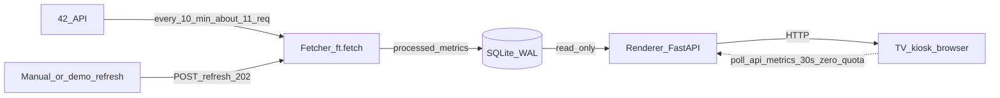

<!-- File: docs/architecture.md -->

# Technical architecture

Hackathon deliverable #2 — Intra-Vision (42 Warsaw Hacks). Updated **Saturday 1 Aug 2026**
after a successful live Warsaw fetch and `POST /refresh` verification.

## The constraint that determines the design

The 42 API allows **2 requests/second and 1200 requests/hour**. A campus dashboard on a TV runs
continuously, so a naive design — fetch on page render — fails in three separate ways:

1. Every browser refresh costs quota; an accidental reload loop takes the display down for an hour.
2. Every 42 API hiccup blanks the TV.
3. Per-student fan-out over hundreds of students burns the hourly budget in one refresh.

So the system is split in two, and **the renderer never touches the 42 API**.



Consequences, all demoable:

- Page loads cost **zero** API quota.
- If the 42 API is down, the TV keeps rendering the last good data with an honest
  "updated … ago" timestamp (amber after 30 minutes).
- Offline path: `make demo` / `make fetch` from `fixtures/` — works with wifi unplugged.

## Components

| Component | File | Responsibility |
|---|---|---|
| API client | [src/ft/client.py](../src/ft/client.py) | OAuth2 client-credentials, token refresh at 90% of 7200s, 2/s + 1200/hr limiter, pagination, retry/backoff |
| Fetch job | [src/ft/fetch.py](../src/ft/fetch.py) | Four collections → metrics → store; `--fixtures` / `--save-fixtures` |
| Metrics | [src/ft/metrics.py](../src/ft/metrics.py) | Pure transforms; unit-tested in `tests/test_metrics.py` |
| Store | [src/ft/store.py](../src/ft/store.py) | SQLite WAL; latest snapshot + bounded history for level-up diffs |
| Renderer | [src/ft/app.py](../src/ft/app.py) | FastAPI: `GET /`, `GET /api/metrics`, `POST /refresh`, `GET /healthz` |
| TV view | [src/ft/templates/dashboard.html](../src/ft/templates/dashboard.html) | 1920×1080-oriented rotating views; local poll only |
| Probe | [src/ft/probe.py](../src/ft/probe.py) | Measured API behaviour → `docs/api-probe-results.md` |
| Optional shell | `app/` + `components/` | Next.js carousel stubs — **not** on the critical path |

Pinned ids: **campus 67 (Warsaw)**, **cursus 21 (`42cursus`)**.

## Request budget (measured)

Live refresh on 1 Aug 2026 used **11 requests** end-to-end (plus 1 token POST when cold):

| Collection | Requests (approx) | Notes |
|---|---|---|
| `projects_users` (14d `marked_at`, campus 67) | 2 | `X-Total=174` |
| `cursus/21/cursus_users` | 6 | `X-Total=575` at `page[size]=100` |
| `blocs` → coalitions | 1 | 3 Warsaw coalitions |
| `locations?active=true` | 1 | 27 open sessions |
| **Total** | **~11** | |

At a 10-minute cadence: **~66 requests/hour ≈ 5.5% of 1200**. Manual `POST /refresh` during a
demo is cheap. `FT_MAX_PAGES` caps runaway pagination.

## Refresh mechanism (brief requirement)

1. **Scheduled / CLI:** `python -m ft.fetch` or cron every 10 minutes.
2. **On demand:** `POST /refresh` → **202** `{ "status": "refresh scheduled" }`; fetch runs in a
   background task with a lock so overlapping presses do not stack.
3. **TV polling:** browser `GET /api/metrics` every 30s — SQLite only, **zero** Intra quota.

Verified 1 Aug 2026: `last_refresh` advanced after `POST /refresh` (~20s for a full live cycle).

## Failure behaviour

| Failure | Response |
|---|---|
| One endpoint errors | `_safe()` logs it, returns `[]`, other panels still update |
| API returns 429 | Honours `Retry-After`, exponential backoff |
| API fully down | Cache served; stamp turns amber past 30 min; never blank |
| Token expired | Proactive refresh at 90% lifetime; 401 forces re-acquire |
| Empty results | Panels render an explicit empty message |
| Poll fails | Browser keeps last paint; stamp ages honestly |
| `/v2/campus/:id/stats` | **403** on public token — panel not built |
| Bare `/graph/.../by/day` for projects/cursus | **422** — lists used instead |

## TV display contract

- Target **1920×1080**, passive kiosk, no hover-only content.
- Large type (`vh`-based), high contrast on near-black.
- Rotation: validations (30s) → pulse → coalitions → levels (20s each).
- Motion: slow fade / 3.2s opacity breathe on fresh rows — no sub-200ms flicker.

## Deployment

Recommended: small VPS or Pi behind the TV.

```
[Unit]
Description=42 Warsaw Intra-Vision
After=network.target

[Service]
WorkingDirectory=/opt/42dash
EnvironmentFile=/opt/42dash/.env
ExecStart=/opt/42dash/.venv/bin/uvicorn ft.app:app --host 0.0.0.0 --port 8000
Environment=PYTHONPATH=/opt/42dash/src
Restart=always
RestartSec=5

[Install]
WantedBy=multi-user.target
```

Fetcher cron: `*/10 * * * * cd /opt/42dash && PYTHONPATH=src .venv/bin/python -m ft.fetch`

Kiosk: `chromium --kiosk --noerrdialogs --disable-session-crashed-bubble http://dash.local:8000`

Secrets in `/opt/42dash/.env` mode 600 — never in the repo. Browser receives metrics JSON only.

## Deliberate limitations (pitch-ready)

- Data up to ~10 minutes stale by design; stamp always visible.
- `campus/:id/stats` blocked (403); coalitions come from `blocs`.
- Bare `/graph` paths for projects_users / cursus_users returned 422; not relied on.
- Level-ups need a prior SQLite snapshot — empty on cold start.
- Single instance, single SQLite file — correct for one Social Space TV.
- Next.js UI in-repo is a stub; production PoC path is FastAPI + Jinja.
