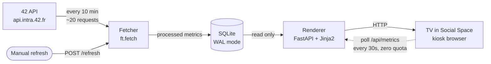

# Technical architecture

Draft of hackathon deliverable #2. Update Saturday once the announced task is known.

## The constraint that determines the design

The 42 API allows **2 requests/second and 1200 requests/hour**. A campus dashboard on a TV runs
continuously, so a naive design — fetch on page render — fails in three separate ways:

1. Every browser refresh costs quota; an accidental reload loop takes the display down for an hour.
2. Every 42 API hiccup blanks the TV.
3. Per-student fan-out over ~300 students costs ~300 requests, so even a 10-minute cadence
   overruns the hourly budget.

So the system is split in two, and **the renderer never touches the 42 API**.



Consequences, all of which are demoable:

- Page loads cost **zero** API quota.
- If the 42 API is down, the TV keeps rendering the last good data with an honest
  "updated 2 hours ago" timestamp.
- The demo works with the wifi unplugged.

## Components

| Component | File | Responsibility |
|---|---|---|
| API client | [src/ft/client.py](../src/ft/client.py) | OAuth2 client-credentials, token refresh at 90% of the 7200s lifetime, rate limiting, pagination, retry/backoff on 429/5xx |
| Fetch job | [src/ft/fetch.py](../src/ft/fetch.py) | Pulls the four collections, builds metrics, writes the store |
| Metrics | [src/ft/metrics.py](../src/ft/metrics.py) | Pure transforms, raw JSON to display-ready numbers. No I/O, fully unit-tested |
| Store | [src/ft/store.py](../src/ft/store.py) | SQLite. Latest snapshot plus bounded history for level-up diffs |
| Renderer | [src/ft/app.py](../src/ft/app.py) | FastAPI. Reads store only, serves HTML + JSON + refresh trigger |
| TV view | [src/ft/templates/dashboard.html](../src/ft/templates/dashboard.html) | Self-contained, no external assets, rotating full-screen views |
| Probe | [src/ft/probe.py](../src/ft/probe.py) | Measures undocumented API behaviour; feeds the research doc |

## Request budget

Per refresh cycle, campus-scoped, `page[size]=100`:

| Collection | Requests | Notes |
|---|---|---|
| `projects_users` | ~4–10 | Bounded by `range[marked_at]` to 14 days |
| `cursus_users` | ~3–6 | ~300 students at 100/page |
| `coalitions` + `blocs` | ~2 | Tiny |
| `locations` (active) | ~1–5 | Only open sessions |
| Token refresh | ~1 per 2h | Amortised |
| **Total** | **~12–25** | |

At a 10-minute cadence: **~72–150 requests/hour, or 6–12% of the 1200 ceiling.** That leaves ample
headroom for manual refreshes during a demo and for adding panels later.

`FT_MAX_PAGES` caps pages per collection so a campus growth spurt can't silently blow the budget.

## Failure behaviour

| Failure | Response |
|---|---|
| One endpoint errors | `_safe()` logs it, returns `[]`, other panels still update |
| API returns 429 | Honours `Retry-After`, exponential backoff |
| API fully down | Cache served, timestamp turns amber past 30 min, never blank |
| Token expired | Proactive refresh at 90% lifetime; 401 forces re-acquire and retries |
| Fetcher crashes | Renderer unaffected; systemd restarts it |
| Renderer crashes | systemd restarts; browser poll retries automatically |
| Empty results | Panels render "no validations yet" rather than an empty box |
| Poll fails | Browser keeps last render, lets the timestamp age honestly |

## Deployment

Recommended: a small VPS (~5 EUR/month) or a Raspberry Pi behind the TV.

```
[Unit]
Description=42 Warsaw dashboard
After=network.target

[Service]
WorkingDirectory=/opt/42dash
EnvironmentFile=/opt/42dash/.env
ExecStart=/opt/42dash/.venv/bin/uvicorn ft.app:app --host 0.0.0.0 --port 8000
Environment=PYTHONPATH=/opt/42dash/src
Restart=always
RestartSec=5

[Install]
WantedBy=multi-user.target
```

Fetcher on cron: `*/10 * * * * cd /opt/42dash && PYTHONPATH=src .venv/bin/python -m ft.fetch`

TV runs Chromium in kiosk mode pointed at the URL:
`chromium --kiosk --noerrdialogs --disable-session-crashed-bubble http://dash.local:8000`

Secrets live in `/opt/42dash/.env`, mode 600, never in the repo. The browser receives only
rendered metrics — no credentials ever reach the client.

## Deliberate limitations

Worth stating in the pitch rather than hiding:

- Data is up to 10 minutes stale by design. For a celebration board that is fine; the timestamp is
  always visible so the display never misrepresents freshness.
- `filter`/`sort`/`range` support per endpoint is not documented and is verified empirically by
  `ft.probe`. Where unsupported, filtering falls back to client-side over a bounded window.
- The `public` scope on a client-credentials token cannot reach some collections (exams, notes).
  Panels depending on those were not built.
- History only extends back to first deployment — the API offers no cheap backfill, so
  "level-ups since last snapshot" starts empty on a cold start.
- Single instance, single SQLite file. Correct for one TV; would need rework for many campuses.
